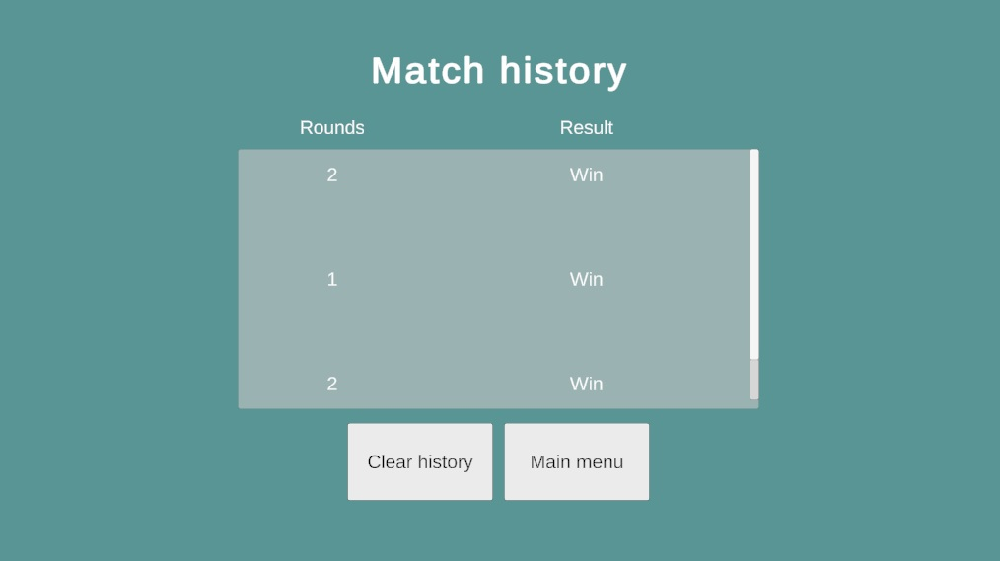

# RockPaperScissors

## Table of Contents
- [Overview](#overview)
- [Architecture](#architecture)
- [Game Settings](#game-settings)
- [Screenshots](#screenshots)

## Overview
This project is a simple rock-paper-scissors-lizzard-spock game where a single player competes against the computer in a match to the best of 5 rounds.

## Architecture
The game uses and MVC pattern where Model classes contains the logic, the UI Panels handle the view and States are the controllers.

To improve testability, the Model clases are highly decoupled so unit tests can be added without issues.

Lastly, the two main components that uses the singleton pattern are the Model and UIManager. This allows the controllers to easily get and update information in the model and the screen

### GameManager
The `GameManager` acts as the controller of the game. It uses a state machine to control the game's flow across different phases, such as the main menu, gameplay, and results screen.

### UIManager
The `UIManager` serves as the view manager. It is responsible for handling all UI-related elements and uses C# generics to access and display the necessary views dynamically.

### Model
The `Model` is responsible for all the game logic. This class contains all the methods needed by the controllers and view to play a match.

## Game Settings
The game settings are set up in the Model class. At the same time, the "moves" (rock, paper, scissors, etc) are set up in Scriptable Objects containing an identifier, image, and interactions with other "moves".

Each move also need to be set up in an enum before creating the scriptable object.
The AI can also be configured with a scriptable object with the rubberband rules, this allows multiple AI configurations that can be interchangeable

## Screenshots
| Description               |                                   |
|---------------------------|-----------------------------------|
| Main menu                 |  |
| Action selection          |  |
| Round result              |  |
| Match result              |  |
| Match history             |  |

