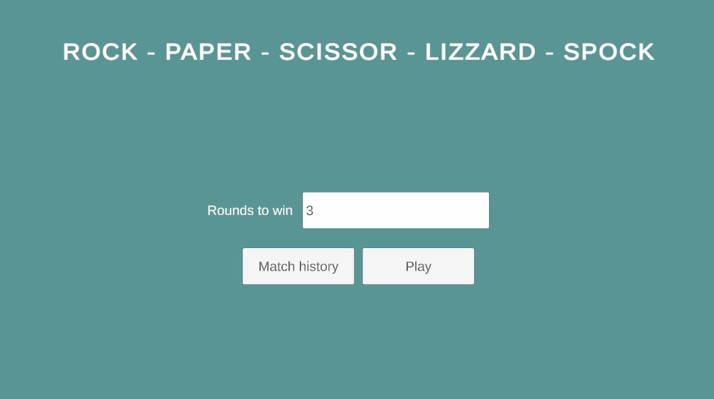
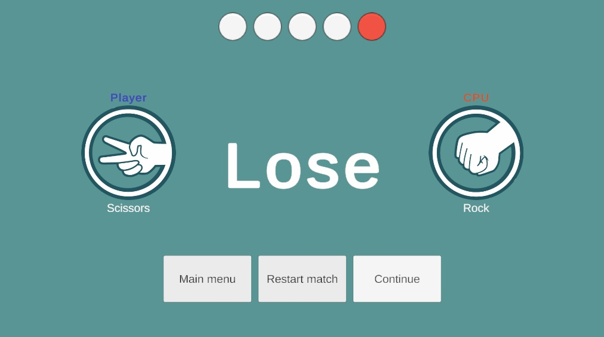

# RockPaperScissors

## Table of Contents
- [Overview](#overview)
- [Architecture](#architecture)
- [Game Content](#game-content)
- [Game Flow](#game-flow)

## Overview
This project is a simple rock-paper-scissors-lizzard-spock game where a single player competes against the computer in a match to the best of 5 rounds.

## Architecture
The game uses and MVC pattern where Model classes contains the logic, the UI Panels handle the view and States are the controllers.

### GameManager
The `GameManager` acts as the controller of the game. It manages the core game logic and uses a state machine to control the game's flow across different phases, such as the main menu, gameplay, and results screen.

### UIManager
The `UIManager` serves as the view manager. It is responsible for handling all UI-related elements and uses C# generics to access and display the necessary views dynamically.

### MatchModel
The `MatchModel` is a facade to interact with all the game logic. This class contains all the methods needed by the controllers and view to play a match

## Game Content
The game "moves" (rock, paper, scissors, etc) are set up in Scriptable Objects containing an identifier, image, and interactions with other "moves".
Each move also need to be set up in an enum before creating the scriptable object.

## Game Flow
The game has a main menu screen with a button to start a match. Once the game has started you can play until somebody wins 3 rounds and the match ends or restart the match at any moment.

### Screenshots
| Description               |                                   |
|---------------------------|-----------------------------------|
| Main menu                 |  |
| Action selection          |  |
| Countdown                 |  |
| Round result              |  |
| Match result              |  |

